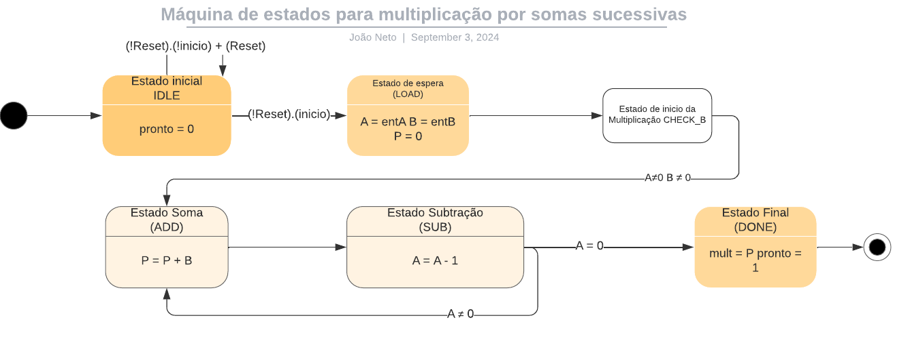

# SAMVhdl
 
# Multiplication by Successive Additions - SAM in VHDL


[](https://github.com/joaosnet/SAMVhdl/blob/master/README.pt-br.md)

## Skills Developed
  

## Introduction

### Digital System Implementation

This project implements a digital system that executes an algorithm using the BO+BC (Operational Block + Control Block) model. The system performs multiplication through repeated addition and subtraction operations.

### Features

- Implements a multiplication algorithm using a single adder/subtractor for cost efficiency
- Uses the BO+BC model for system design
- 4-bit input and output capabilities

### System Specifications

#### Inputs:

- Reset
- Clock (ck)
- entA (4 bits)
- entB (4 bits)

#### Outputs:

- mult (4 bits)
- pronto (ready signal)

#### States:

- Initial state (after reset)
- Wait state (while B = 0)
- Multiplication state (while A ≠ 0)
- Final state (when pronto = 1)

### Algorithm

The system implements the following algorithm:

```vhdl
begin
pronto ← 0
A ← entA
B ← entB
P ← 0
If B ≠ 0 then
    While A ≠ 0 do
        begin
        P ← P + B
        A ← A - 1
        end
mult ← P
pronto ← 1
end
```

This algorithm performs multiplication through repeated addition, using a single adder/subtractor for both P+B and A-1 operations.

### Implementation Details

The system uses a shared adder/subtractor for P+B and A-1 operations, performing each operation in a separate clock cycle for optimal resource utilization.

## FSM - Finite State Machine



## Output in ModelSim


## Outputs.txt


## How to Use

1. Clone this repository
2. Install the dependencies with [Quartus](https://www.intel.com/content/www/us/en/software-kit/669557/intel-quartus-prime-lite-edition-design-software-version-17-0-for-windows.html)
3. open the project with Quartus
4. run RTL simulation


## 🤝 Contributing to Multiplication by Successive Additions - SAM

<table>
  <tr>
    <td align="center">
      <a href="https://www.instagram.com/jaonativi/" title="Desenvolvedor Backend">
        <br>
        <sub>
          <b>João Natividade</b>
        </sub>
      </a>
    </td>
  </tr>
</table>
